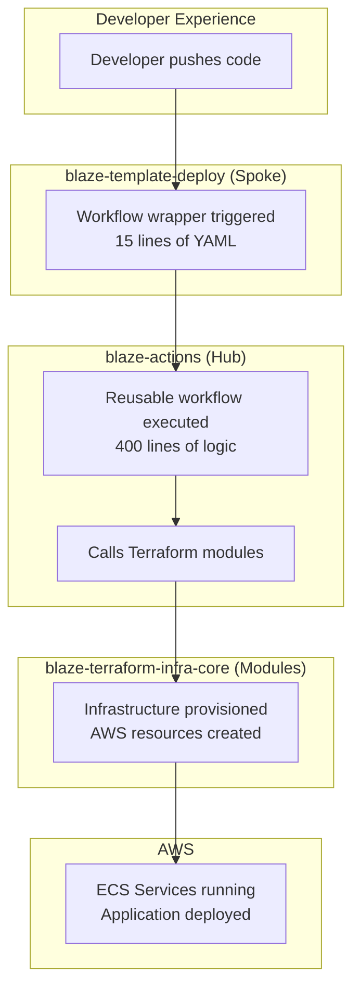

# PART 5: Integration and Complete Workflows

**Document Purpose:** End-to-end examples for Google NotebookLM  
**Target Length:** 3-4 minutes of presentation content  
**Focus:** How all 3 repositories work together

---

## Complete System Integration

### How the 3 Repositories Work Together



---

## End-to-End Workflow Examples

### Example 1: Complete New Environment (From Zero to Production)

**Scenario:** Brand new project, stand up complete infrastructure

**Timeline:** ~2 hours total (including DNS validation wait)

#### Phase 1: Bootstrap (5 minutes)

```yaml
# Run: 00_setup_environment.yml + 01_provision_infrastructure.yml (account-settings)
Trigger: Manual
Environment: DEV

Actions:
1. Create S3 bucket: b9-dev-blaze-tfstate
2. Create DynamoDB table: terraform-state-lock
3. Create ECR repositories:
   - blaze-thisisblaze-web/api
   - blaze-thisisblaze-web/frontend
4. Configure OIDC trust
5. Enable ENI Trunking (account-settings stack)
6. Enable Container Insights (account-settings stack)

Result: AWS infrastructure ready for Terraform
```

#### Phase 2: Network Stack (8 minutes)

```yaml
# Run: 01_provision_infrastructure.yml
Stack: network
Apply: true

Creates:
├── VPC (10.0.0.0/16)
├── Public Subnets × 2
├── Private Subnets × 2
├── NAT Gateways × 2
├── Internet Gateway
├── Route Tables
├── Security Groups
│   ├── ALB (80, 443)
│   ├── ECS (3000)
│   └── RDS (5432)
├── Application Load Balancer
└── EC2 Capacity Provider (optional, enable_ec2=true)
    ├── Auto Scaling Group (Graviton ARM64)
    └── Launch Template (ECS-optimized)

Outputs:
- vpc_id: vpc-abc123
- alb_dns: alb-dev.thisisblaze.com
```

#### Phase 3: SSL Certificates (30-60 min wait)

```yaml
# Run: 01_provision_infrastructure.yml
Stack: acm
Apply: true

Creates:
  - ACM Certificate for *.thisisblaze.com
  - DNS validation records in Route53

Manual Step:
  - Wait for DNS propagation
  - Certificate validation (automatic after DNS)
```

#### Phase 4: Application Stack (12 minutes)

```yaml
# Run: 01_provision_infrastructure.yml
Stack: app
Apply: true

Creates:
├── ECS Cluster: blaze-b9-thisisblaze-dev-cluster
│   └── Capacity Providers: FARGATE, FARGATE_SPOT, EC2 (hybrid)
├── ECS Services
│   ├── API (2 tasks, Fargate or EC2 per config)
│   └── Frontend (2 tasks, Fargate or EC2 per config)
├── Task Definitions (ARM64/x86, per-service launch type)
├── CloudFront Distribution
├── Lambda@Edge (image resize)
├── S3 Buckets
│   ├── Storage origin
│   └── Image resize cache
└── IAM Roles & Policies

Outputs:
- cluster_name
- cloudfront_domain
- s3_bucket_name
```

#### Phase 5: Application Deployment (10 minutes)

```yaml
# Run: 02-deploy-app.yml
Environment: dev
Services: "Blaze all"

Actions:
1. Build Docker images (multi-arch: AMD64 + ARM64)
   - API: Node.js Express
   - Frontend: React/Next.js
2. Push to ECR
3. Update ECS task definitions (per-service launch type)
4. Deploy to ECS (Fargate or EC2, per-service config)
5. Wait for health checks
6. Build admin SPA
7. Deploy to Cloudflare Pages

Result:
- API: https://api-dev.thisisblaze.com
- Frontend: https://dev.thisisblaze.com
- Admin: https://admin-dev.thisisblaze.com
```

**Total Time:** ~2 hours (mostly waiting for certificate)  
**Total Cost:** $0.05-0.10 during provisioning  
**Ongoing Cost:** ~$50-100/month (DEV environment)

---

### Example 2: Hotfix Deployment to Production

**Scenario:** Critical bug found in production, need fix deployed ASAP

**Timeline:** 8-10 minutes

#### Step 1: Code Fix (Developer)

```bash
# Fix the bug
git checkout -b hotfix/critical-bug
# Make fix
git commit -m "fix: resolve critical payment issue"
git push origin hotfix/critical-bug

# Create PR, get approval, merge
```

#### Step 2: Automated Deployment

```yaml
# Triggered by merge to main
Workflow: 02-deploy-app.yml
Environment: prod
Services: "api"  # Only API service needs update

Actions:
1. Checkout code
2. Build Docker image (API only)
   - Uses layer caching (fast)
   - Time: 2 minutes
3. Push to ECR
   - Time: 30 seconds
4. Update task definition
   - New image tag
   - Time: 10 seconds
5. ECS blue/green deployment
   - Start new tasks
   - Health check validation
   - Switch traffic
   - Stop old tasks
   - Time: 5 minutes

Total: 8 minutes
Downtime: 0 seconds
```

**Rollback if needed:**

```yaml
# If new version has issues
Action: Revert merge commit
Trigger: 02-deploy-app.yml again
Time: 8 minutes to previous version
```

---

### Example 3: Multi-Tenant Setup

**Scenario:** Support multiple clients with isolated resources

**Client A: ACME Corp**

```json
// vars/acme/blaze-env.json
{
  "common": {
    "NAMESPACE": "acme"
  },
  "client_key": "acme",
  "project_key": "webapp"
}
```

**Resources Created:**

```
acme-acme-webapp-prod-cluster
acme-acme-webapp-prod-vpc
acme-acme-webapp-prod-alb
```

**Client B: Widget Inc**

```json
// vars/widget/blaze-env.json
{
  "common": {
    "NAMESPACE": "widget"
  },
  "client_key": "widget",
  "project_key": "platform"
}
```

**Resources Created:**

```
widget-widget-platform-prod-cluster
widget-widget-platform-prod-vpc
widget-widget-platform-prod-alb
```

**Benefits:**

- Complete isolation
- No resource conflicts
- Independent scaling
- Separate cost tracking

---

## Configuration Flow

### How Configuration Flows Through the System

```
1. Developer edits:
   vars/blaze-env.json

2. Workflow triggered:
   .github/workflows/01-provision-infra.yml (wrapper)

3. Calls blaze-actions:
   reusable-calculate-config.yml
   └── Loads JSON
   └── Parses values
   └── Outputs variables

4. Variables used in:
   reusable-terraform.yml
   └── Passes to Terraform as TF_VAR_*

5. Terraform uses variables:
   module "network" {
     namespace = var.namespace
     ...
   }

6. AWS resources created:
   ${namespace}-${client}-${project}-${stage}-cluster
```

**Single source of truth:** `vars/blaze-env.json`

---

## Monitoring and Operations

### Daily Health Check (Automated)

```yaml
# Runs: 90-daily-health-check.yml
Schedule: Daily at 6 AM UTC

Checks:
1. ECS Services running?
2. Tasks healthy?
3. SSL certificates valid?
4. API endpoints responding?
5. Cloudflare Pages deployed?
6. Terraform drift detected?

Notifications:
- Slack alert on failure
- GitHub issue created
- Email to ops team
```

### Manual Operations

```yaml
# Workflow: 99-ops-utility.yml

Available Actions:
  - view-config
  - check-stack-exists
  - unlock-state
  - nuke-environment
  - cleanup-cloudflare-deployments
  - destroy-cloudflare-pages-bulk

Example:
Action: cleanup-cloudflare-deployments
Retention: Keep 5 latest
Dry-run: true (preview first)
```

---

## Security in Practice

### 1. No Long-Lived Credentials

**Every workflow:**

```yaml
permissions:
  id-token: write # Request OIDC token

steps:
  - uses: aws-actions/configure-aws-credentials@v4
    with:
      role-to-assume: arn:aws:iam::123456789012:role/GitHubActions
      # Credentials expire after 1 hour automatically
```

### 2. Automated Security Scanning

**On every commit:**

```yaml
# Workflow: 05_ci_no_cloud.yml
Runs:
- Terraform fmt (code style)
- Terraform validate (syntax)
- tfsec (security scan)
- Semgrep (code analysis)

# Workflow: 10_security_scan.yml
Runs:
- Trivy (container vulnerabilities)
- Dependency check
- License compliance
```

### 3. Environment Protection

**Production requires approval:**

```yaml
# GitHub Settings → Environments → PROD
Required reviewers: 2
Wait timer: 15 minutes
Deployment branches: main only
```

---

## Cost Management

### Cost Optimization Strategies

**DEV Environment:**

- Fargate Spot instances (70% cheaper)
- Minimal task count (1-2)
- No auto-scaling
- Short log retention (7 days)

**PROD Environment (Hybrid Fargate + EC2):**

- Fargate for bursty/low-traffic services
- EC2 Graviton (ARM64) for high-density workloads (100+ sites)
- EC2 Spot + On-Demand mixed ASG (60-80% savings over pure Fargate)
- Auto-scaling (2-10 tasks)
- High availability (multi-AZ)
- Long log retention (90 days)

**Automated Cleanup:**

```yaml
# Unused resources deleted
- Old Cloudflare deployments
- Unused ECR images
- Expired CloudWatch logs
- Terraform state backups
- EC2 instances (ASG scaled to 0 on destroy)
```

**Average Costs:**

- DEV: $50-100/month (Fargate only)
- STAGE: $150-200/month (Fargate only)
- PROD (Fargate): $500-1000/month
- PROD (Hybrid EC2): $200-500/month (50-70% savings for large clients)

**vs. Manual setup:** 50-70% more expensive without optimization

---

## Lessons Learned

### What Works Well

1. **Hub & Spoke Pattern**
   - Update once, affect all projects
   - 96% code reduction
   - Perfect consistency

2. **Dynamic Namespace**
   - Multi-tenancy support
   - Resource isolation
   - Flexible deployment

3. **Automated Security**
   - 100% scan coverage
   - Zero credential leaks
   - Compliance ready

4. **Documentation First**
   - Mermaid diagrams
   - Client onboarding guide
   - Troubleshooting docs

### What We'd Do Differently

1. **Start with namespace support**
   - Don't hardcode anything
   - Plan for multi-tenancy from day 1

2. **Version pin from start**
   - Establish versioning strategy early
   - Use semantic versioning

3. **More automated tests**
   - Terraform module tests
   - Integration tests
   - Daily validation

---

## Future Roadmap

### Planned Improvements

1. **Enhanced Monitoring**
   - Cost tracking per namespace
   - Performance metrics
   - Usage analytics

2. **Advanced Deployment**
   - Canary deployments
   - A/B testing support
   - Progressive rollouts

3. **Multi-Cloud Support**
   - Azure modules
   - GCP modules
   - Hybrid cloud patterns

4. **Developer Experience**
   - CLI tool for operations
   - Local development environment
   - Preview environments for PRs

---

## Call to Action

### For Leadership

**Adopt Blaze Infrastructure Platform:**

- Reduce deployment time by 95%
- Eliminate security incidents
- Enable rapid scaling
- Improve developer productivity

**ROI:** $100K+/year in time savings

### For Engineers

**Start using today:**

1. Clone blaze-template-deploy
2. Follow CLIENT_ONBOARDING.md
3. Deploy in 1 hour
4. Contribute improvements back

**Resources:**

- GitHub: github.com/thisisblaze/blaze-actions
- Docs: Full documentation in each repo
- Support: Open issues or discussions

---

**Document Version:** 1.0  
**Last Updated:** 2026-02-09  
**Estimated Presentation Time:** 3-4 minutes  
**Total Series Time:** 15-20 minutes (all 5 parts)
